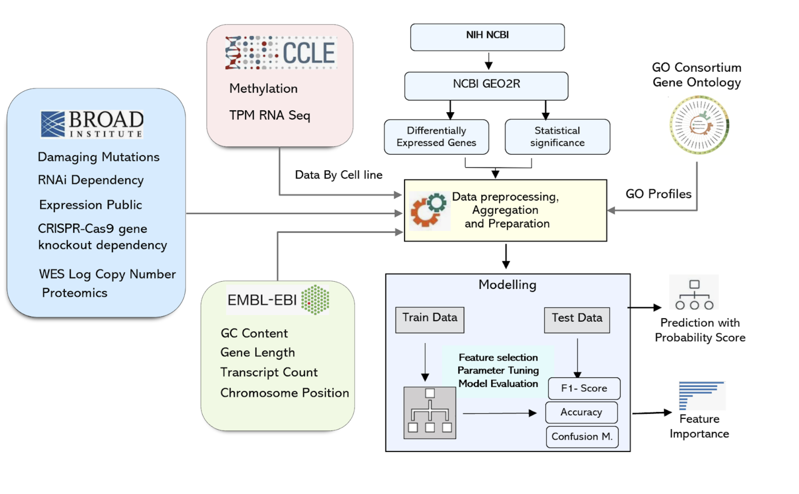

## Predicting Personalized Responses to HDACi and PROTAC Therapies: A Data-Driven Approach

Histone deacetylase inhibitors (HDACi) and Proteolysis-Targeting Chimeras (PROTACs) are two classes of targeted therapeutic agents that hold promise for cancer therapy by changing gene regulation and targeting protein degradation. However, predicting their precise effects on gene expression and identifying key biomarkers remains challenging. This study addresses the problem of predicting the gene expression changes induced by HDACi and PROTACs in cancer cells using integrated bioinformatics and machine learning approaches. Here we show that by integrating genomic, transcriptomic, and epigenomic data, we can accurately predict the regulatory pathways and key biomarkers influenced by these therapeutic agents. This result advances our understanding of the specific molecular mechanisms of these drugs, offering a more precise and data-driven approach. This knowledge could lead to the development of personalized cancer therapies and the identification of potential therapeutic targets. Ultimately, this work contributes to the goal of improving cancer outcomes by leveraging computational methods to enhance our ability to predict and manipulate cellular responses to therapeutic interventions.

##How I got the data
Integrating diverse genomic and proteomic data from various sources necessitates careful handling of different file formats. This study employed a range of computational techniques and tools for data extraction and processing, including:
<ul>
<li>	R/biomaRt: Used for accessing gene annotations and other genomic information. </li>
<li>	Python/pybedtools & pyranges: Employed for efficient manipulation of genomic interval data in BED files.</li>
<li>	Custom Python scripts (with libraries like requests): Developed for programmatic downloads and parsing of data from different repositories.</li></ul>
General Bioinformatics Tools & Scripting Languages: Utilized to ensure data integrity and facilitate downstream analysis.
This multifaceted approach enabled the seamless integration of data from diverse sources, laying the foundation for robust machine learning model development.
  

